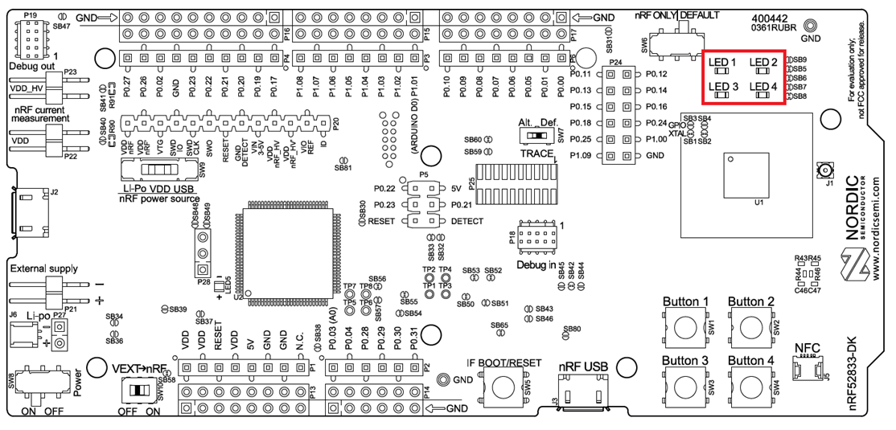
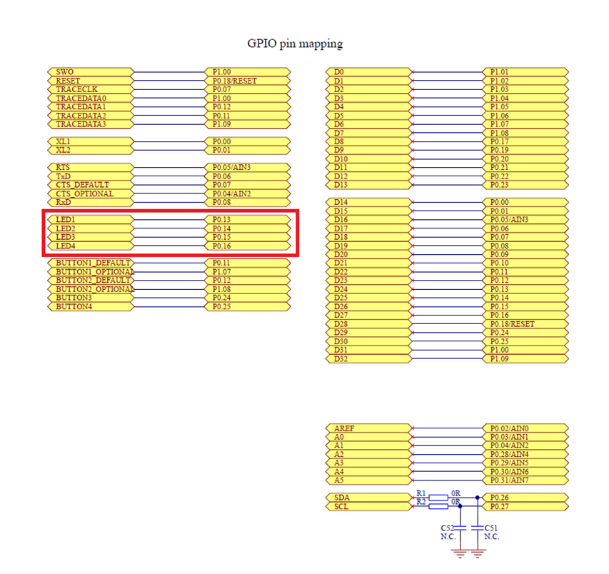
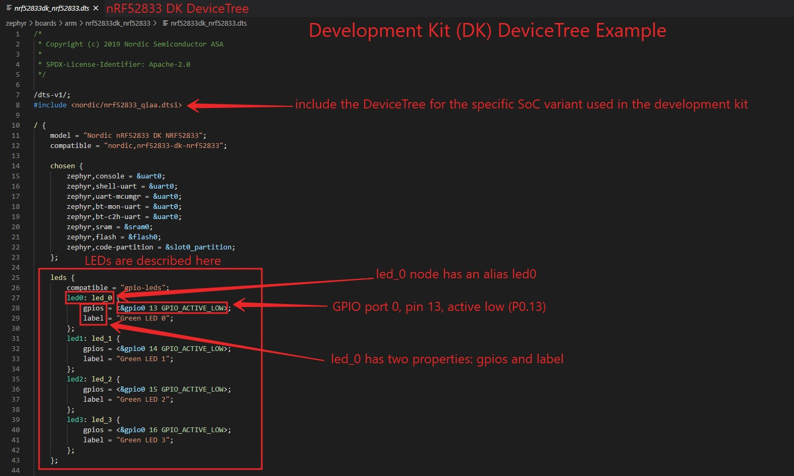
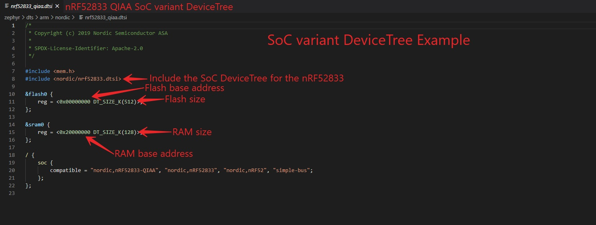
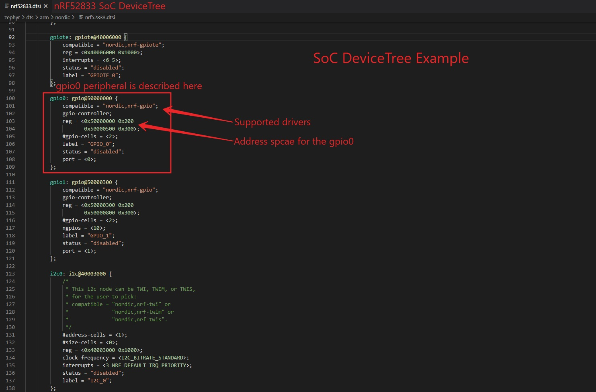

# DeviceTree

In Embedded Systems firmware development, hardware is traditionally described inside header files (.h). nRF Connect SDK uses a more structured and 
modular method to describe hardware which is through devicetree. A devicetree is a hierarchical data structure that describes hardware. The hardware 
described could be a development kit, SoC, SiP, module, etc. 
Everything from the GPIO configurations of the LED’s on a development kit to the memory-mapped locations of peripherals. The devicetree uses a specific 
format consisting of nodes connected together, where each node contains a set of properties. The following section is derived from the Zephyr project website:

As the name indicates, a devicetree is a tree. The human-readable text format for this tree is called DTS (for devicetree source).

Here is an example DTS file:

    /dts-v1/;
    / {
            a-node {
                    subnode_label: a-sub-node {
                            foo = <3>;
                    };
            };
    };
    
The tree has three nodes:
- A root node: /
- A node named a-node, which is a child of the root node
- A node named a-sub-node, which is a child of a-node

Nodes can be given labels, which are unique shorthands that can be used to refer to the labeled node elsewhere in the devicetree. Above, a-sub-node 
has label subnode_label. A node can have zero, one, or multiple node labels.

Devicetree nodes can also have properties. Properties are name/value pairs. Property values can be an array of strings, bytes, numbers, or any mixture of types.

Node a-sub-node has a property named foo, whose value is a cell with value 3. The size and type of foo‘s value are implied by the enclosing angle brackets (< and >) in 
the DTS. Properties might have an empty value if conveying true-false information. In this case, the presence or absence of the property is sufficiently descriptive.

Devicetree nodes have paths identifying their locations in the tree. Like Unix file system paths, devicetree paths are strings separated by slashes (/), and 
the root node’s path is a single slash: /. Otherwise, each node’s path is formed by concatenating the node’s ancestors’ names with the node’s own name, 
separated by slashes. For example, the full path to a-sub-node is /a-node/a-sub-node.

Let’s take an actual example to better understand these concepts, the nRF52833 DK has four user-configurable LEDs (LED1 – LED4 ) connected to GPIO 
pins P0.13 – P0.16 as shown in the screenshots below obtained from the schematics of the nRF52833 DK.

These hardware details are all described in the devicetree file (nrf52833dk_nrf52833.dts) for the nRF52833 DK.

Examine the devicetree for the nRF52833 DK  nrf52833dk_nrf52833.dts available in <nRF Connect SDK Installation Path>\zephyr\boards\arm\nrf52833dk_nrf52833.
    

    
The first thing to notice in the development kit devicetree is that it includes the devicetree for the specific SoC variant used in the development kit. In the case of the nRF52833 DK, it is the nrf52833_qiaa.dtsi available in the directory <nRF Connect SDK Installation Path>\zephyr\dts\arm\nordic. The i in dtsi stands for Include. dtsi files generally containing SoC-level definitions.

LED1 on the nRF52833 DK is called led_0 (or the alias led0).

The led_0 has two properties: gpios and label. You can see that the property gpios is referencing the node gpio0 through the & symbol. gpio0 is defined in the SoC devicetree, as we will see in the following paragraph.

The GPIO pin where LED1 is connected to the nRF52833 is described by line 28 in the .dts file.

    gpios = <&gpio0 13 GPIO_ACTIVE_LOW>;
    
Now, examine the SoC variant devicetree nrf52833_qiaa.dtsi available in the directory <nRF Connect SDK Installation Path>\zephyr\dts\arm\nordic.    
    
    
    
You can see it contains information related to the SoC variant (version) used in the development kit. Such as the SoC RAM and Flash base addresses and sizes. The SoC variant devicetree includes the base SoC devicetree nrf52833.dtsi, which is available in the same directory. The SoC devicedtree contains SoC-level hardware description for all the peripherals and system blocks.

Examine the SoC devicetree nrf52833.dtsi available in the directory <nRF Connect SDK Installation Path>\zephyr\dts\arm\nordic.
    
    
    
This gives us enough information about devicetree. To get more information about devicetree, you can download the devicetree specification from here:
    [https://www.devicetree.org/specifications/](https://www.devicetree.org/specifications/)
    
    
    
    
    
