# 1. Threads creation and priorities

In this exercise, we will learn about threads creation and how they can affect one another with their priorities.

Download the exercise file ZephyrRTOS_1.zip and extract it somewhere on your hard drive. Open the project by Selecting "Add an existing application" in nRF Connect for VS Code.

Please remember to select the correct board you are using while configuring the project options as done in previous exercises. The main.c looks like below. There are only 
threads and no main() function which is OK as CONFIG_MULTITHREADING is enabled by default by the nRF Connect SDK.

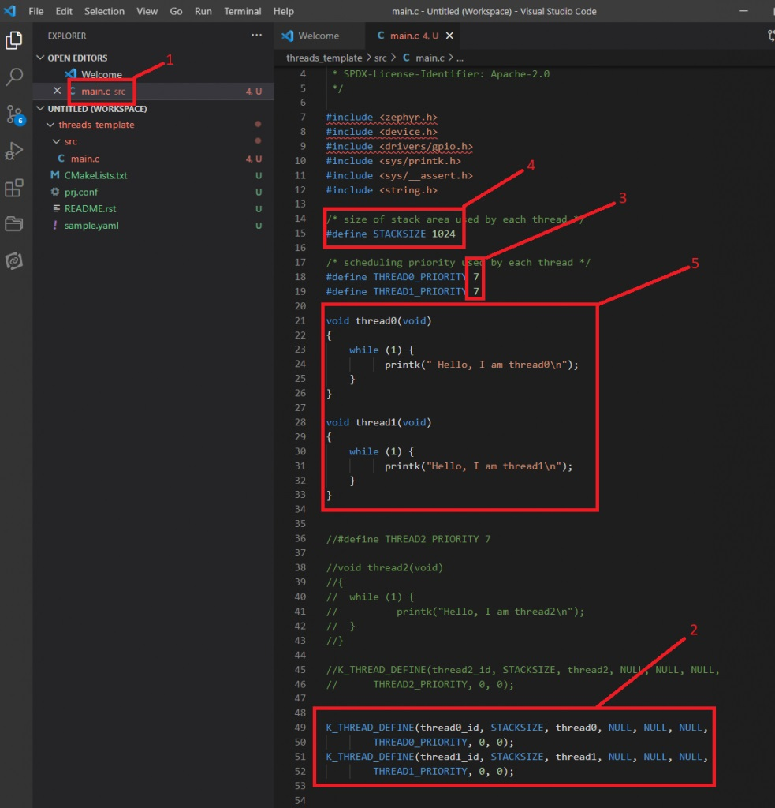

1. This is where you find the main.c file in the IDE.
2. K_THREAD_DEFINE is the macro for declaring a thread and plugging its data structures into the RTOS kernel. Here you can see that we have created the two threads named thread0 and thread1.
3. Thread priority used in this exercise. We use the same priority here to start with to demonstrate few features.
4. Stack size for the threads. Even though the threads are simple in this exercise we are using 1K stack size generously. In actual application development, you need to benchmark the threads stack usage if the free stack size is getting too tight. We do not need that here for a simple application like this.
5. Definitions of the threads. They do nothing but loop for ever printing their name to the serial terminal. Important thing to note here is that both the threads have no dependency on each other and they do not yield or sleep, so they will always be in the ready state (not blocked) competing for the CPU resource.

K_THREAD_DEFNE API description:
https://developer.nordicsemi.com/nRF_Connect_SDK/doc/latest/zephyr/reference/kernel/threads/index.html#c.K_THREAD_DEFINE

Open any of the serial terminal program and connect to your device. Now go to the nRF Connect Extension (Ctrl + Alt + N), Build (Ctrl + Alt + B) and Flash(Ctrl + Alt +F) your application or you can use below options as well.

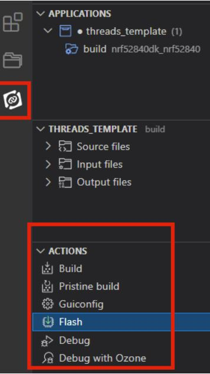

After you have flashed the firmware, you can see in the terminal program the following output:

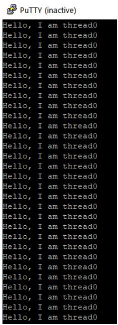

If you have observed the output of the terminal program, you noticed that it is only thread0 that is running and thread1 never gets to run ever (starved) even though both threads are created with same parameters and priority. The second thread is always starving since thread0 has been selected by the scheduler but this thread0 never yields, blocks or waits on anything.

Let’s see how we can fix this.

## 1.1 Thread yielding
In the previous exercise, the equal priority thread0 is always starving thread1 because thread0 never yields, so in this exercise we will make the thread0 to yield (voluntarily) using k_yield(). A thread normally yields when it either has nothing else to do and wants to give other equal/higher priority threads a chance to run (when time slicing size is limited, you will know more about this in next exercise), so there is always some logic behind when a thread wants to call k_yield(). But to keep this exercise simple, let us make thread0 yield every time after it finishes with the printk message. Change the thread0 definition to below

      void thread0(void)
      {
	      while (1) {
                printk("Hello, I am thread0\n");

                // I'll be nice to other lower or equal priority threads and will yield.
                k_yield();
        }
      }

We just added one line of code here which is k_yield() after printk is processed. Build, Flash and check what you see in the terminal emulator now. It should be something like below.

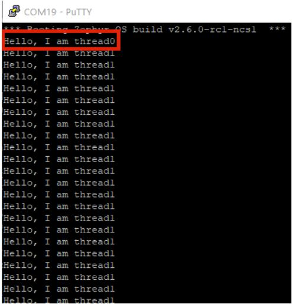

You will see that thread0 is able print one message and yields voluntarily to equal or higher priority threads. Since there is another equal priority thread (thread1) which is ready to get the CPU, this thread1 is now made active by the scheduler and will get the CPU time (executed on the CPU). One interesting thing to notice here is that once thread1 gets active, it runs for ever now starving thread0. This is because even though thread0 cooperatively yielded to thread1, thread1 is now not yielding, hence thread0 is starved indefinitely in this case once thread1 gets active (running). So let us now make thread1 yield as well by adding k_yield() after it prints its message like below.

      void thread1(void)
      {
          while (1) {
              printk("Hello, I am thread1\n");

              // I'll be nice to other lower of equal priority threads and will yield.
              k_yield();
          }   
      }

Build, Flash and check what you see in the terminal emulator now. It should be something like below.

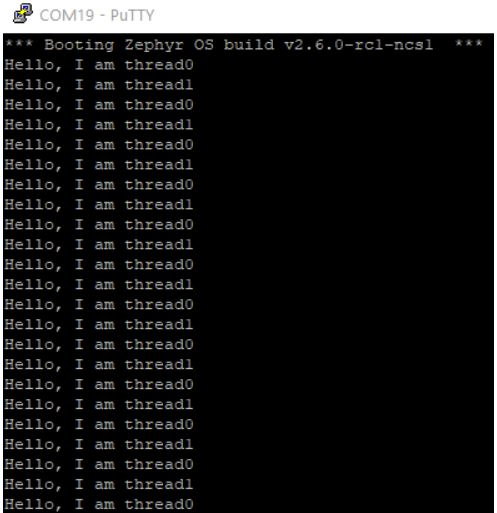

And the events on the CPU should look something like below

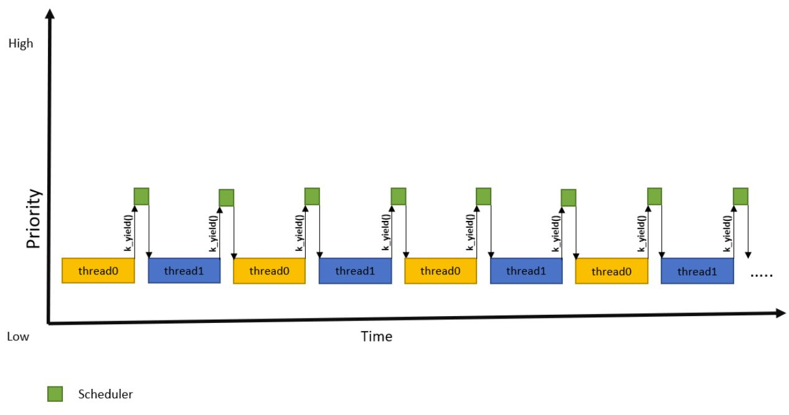

Here one can notice that both threads now yield after printing a message making the scheduler come into the scene and evaluate to see if there are any runnable threads in the queue. The good thing here is that both threads of equal priorities are cooperating, but the disadvantage here could be that each thread calls k_yield() too often invoking the scheduler. Scheduler also needs CPU time to do the book keeping of the kernel resources every time k_yield() is called (remember Rescheduling point section) which will in turn cost power. Good architecture of your system is to design your threads in a way where scheduler takes very little CPU time and gives most of the CPU time to the threads designed with correct priorities and are reasonably considerate (yielding/sleeping/waiting) to other threads. In our example, the scheduler overhead to make other thread active can be more than the overhead of the simple thread just printing a message which is not very power efficient. The better option is from the threads to sleep since it is acceptable for our threads to print less frequently. Sleeping is more power efficient for the threads that wake up, do very little processing and can wait for sometime to repeat this cycle.

## 1.2 Thread sleeping
There are many ways to make the thread relinquish CPU by making it go to “Waiting” state instead of “Ready” and one of them is using k_sleep or the variation of it like k_msleep(). After you finished the previous part of the exercise with thread yielding, replace the k_yield() in both the threads with k_msleep() like below with sleep duration of say 5ms.

      void thread0(void)
      {
          while (1) {
              printk("Hello, I am thread0\n");

              // sleep for 5ms
              k_msleep(5);
          }
      }

      void thread1(void)
      {
          while (1) {
              printk("Hello, I am thread1\n");

              // sleep for 5ms
              k_msleep(5);
          }      
      }

You should see the below out on the terminal emulator.

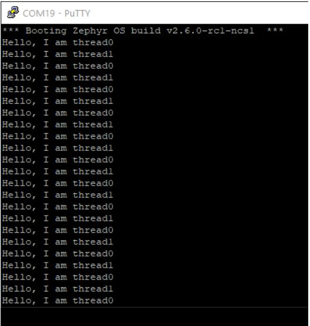

Even though the output looks exactly similar to the version of the threads using k_yield() there is a significant difference here. The threads are printing less frequently (which is acceptable in this case) but also calling the scheduler less frequently. Take a look at this time sequence graph and look at the idle period during which the whole can go to low power states.

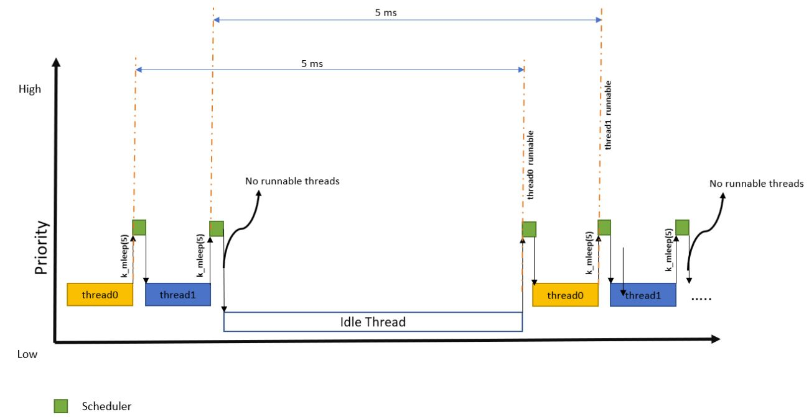

As you can see, when both the threads sleep for certain time and there are no other active threads for the scheduler to make active, the idle_thread (which is one of the system threads) is made active by the scheduler. If we chose k_sleep() instead of k_yield() incorrectly here, then the scheduler would be unnecessarily making the idle thread active too frequently even though the tasks still have something to do before yielding. Activating idle thread unnecessarily or too frequently increases the power consumption of the overall solution. That is also one of the reasons the tickless mode for idle_thread is made the default setting in the Nordic Connect SDK so as to get maximum power saving during idling.

- k_yield() will change the thread state from Running->Ready, which means that the next rescheduling point the thread that just yielded is still a candidate in scheduler’s algorithm to make a thread active (running). The overall result you see is that after the thread yielded there will be at least one item in the ready thread queue for the scheduler to chose from at the next rescheduling point.
- k_sleep(timeout) will change the thread state from Running->Waiting, which means that at the next rescheduling point the thread that just slept will not be a candidate in scheduler’s algorithm until timeout amount of time has passed since calling k_sleep. After that timeout, the thread state is changed again from Waiting->Ready and the thread then becomes a candidate in scheduler’s algorithm to make. Hence thread sleeping is better choice for adding delays and not for yielding.

If the developer do not want to worry about creating a perfect logic for yielding between equal priority threads (so as to NOT starve one thread unintentionally from executing) you can configure the TIMESLICING config for the scheduler and do not to worry about explicitly making equal priority threads yielding. With preemptive scheduling with time slicing enabled you can tell the scheduler to time limit continuous execution time of equal priority threads.

## 1.3 Preemptive Time Slicing
Change the threads definition to the one without k_msleep() or k_yield() and make the priorities equal again like below.

      /* scheduling priority used by each thread */
      #define THREAD0_PRIORITY 7
      #define THREAD1_PRIORITY 7

      void thread0(void)
      {
          while (1) {
              printk("Hello, I am thread0\n");
          }
      }	  

      void thread1(void)
      {
          while (1) {
              printk("Hello, I am thread1\n");
          }
      }

Now the two threads are equal priority and none of the are yielding or sleeping, which we verified that the first thread that starts running should block the other one indefinitely. To avoid that. we can enabled time slicing feature of the scheduler and not worry about them being able to starve each other just because they are of equal priorities. there are other ways one thread can starve other (e.g. semaphore, mutex etc. but that is the topic for later, lets focus on starvation due to priorities here)
Lets change the configuration of the time slicing for the scheduler in our project. For the rest of the RTOS exercises changing the configuration of features for the project can be done in two ways as below

1. Editing proj.conf file
For enabling time slicing for all non negative priority threads, add these lines in your existing proj.conf file in your project folder.

       CONFIG_TIMESLICING=y
       CONFIG_TIMESLICE_SIZE=10
       CONFIG_TIMESLICE_PRIORITY=0

2. Other way than editing the proj.conf file is to open the GUI project settings by clicking the “Guiconfig” from the actions window of the nRF Connect extension of the Visucal Code Studio and open the timeslicing option available in “General Kernel Options-> Timer API Options -> Thread time slicing”. Change the value of TIMESLICE_SIZE from 0 to 10. What this does is that we tell the scheduler that if two threads of equal priorities are in ready state, then the one running has a maximum of 10ms before it is preempted by the scheduler forcefully for the other equal priority ready state thread to be able to run.

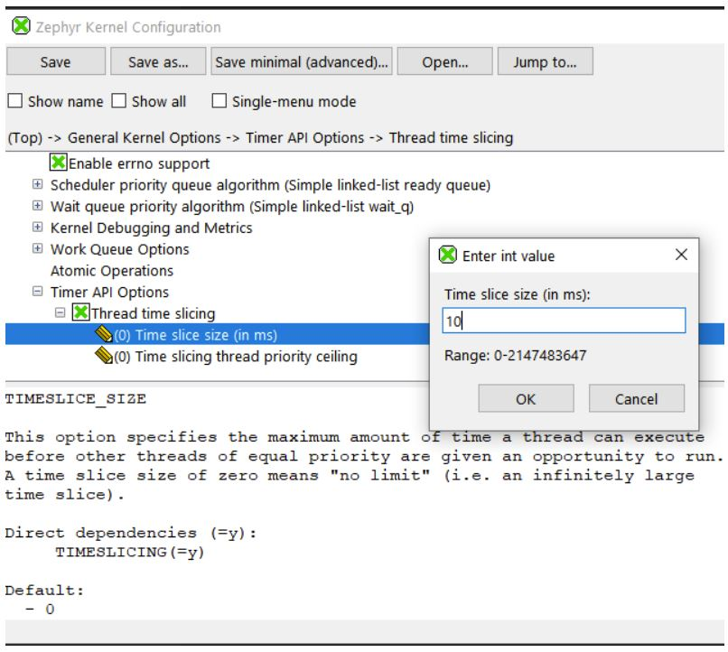
      
Lets see if your changes (in proj.conf or using GUI interface) have any effect. After you save your configuration, build and flash again. Check what you see on your terminal emulator after you flash the newly built firmware. You should see something like below

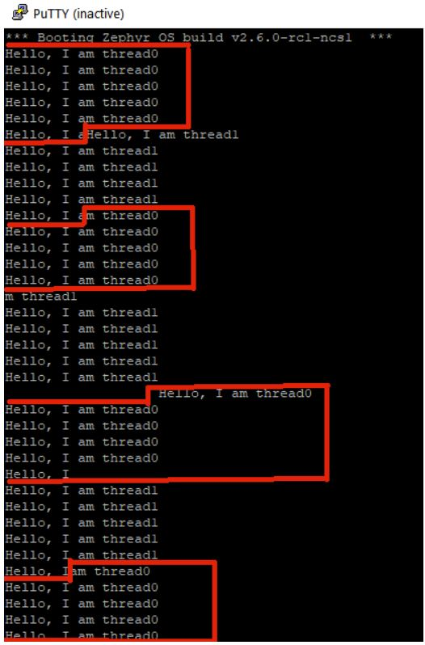

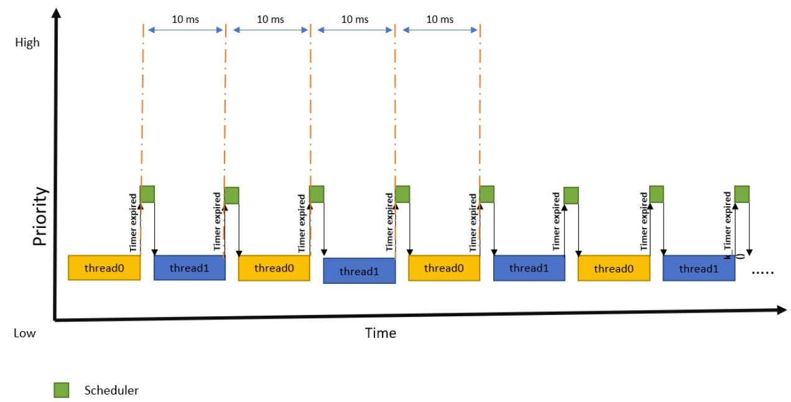

The timeline of the activity should look something like above. Now you see that the scheduler forcefully preempts the thread0 after it runs for 10ms and lets the thread1 run for 10ms after which thread1 is also preempted to give time for thread0 again. The output here might be confusing, but it shows you that the scheduler can preempt the thread irrespective of what it was doing after the configured time slice amount of time (10ms in this exercise). In this context you see that the scheduler can preempt the thread even though it did not print the whole printk message. The new thread will continue to print the message exactly from the same place where it was preempted the last time.

## 1.4 Time slice vs Priorities
In the previous change, you limited the time slice max limit of a single run of one equal priority thread. But it is important to know that time slice configuration only effects equal priorities threads. But what happens when time slice is enabled and there are no equal priority thread to run after the time slice expires. You can find out by increasing the priority (by lowering the value) of one of the threads. For example, if you change the value of THREAD0_PRIORITY to 6 as below (now thread0 is higher priority than thread1 after the change)

       /* scheduling priority used by each thread */
       #define THREAD0_PRIORITY 6
       #define THREAD1_PRIORITY 7

Build, flash and check the terminal emulator and see that the output goes back to the same where thread0 seems to be running uninterrupted and thread1 is starving for ever. Even though the output looks the same, the scheduler preempts thread0 every 10ms (time slice interval) to check if there are any other equal or higher priority ready state threads in the queue. Since there are none (as the waiting thread1 is of lower priority), the scheduler lets the thread0 run for another time slice period, but the output looks as if thread0 was never preempted because scheduler did not find anything else to run and also thread0 is not yielding.     
